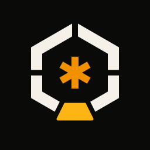

<div align="center">
  <a href="https://terva.sh">
    
  </a>
</div>
<p align="center">
  <a href="https://terva.sh">terva.sh</a>
</p>

> **A hard fork of zot.** terva began as <!-- rename:keep -->
> [patriceckhart/zot](https://github.com/patriceckhart/zot) and took its own name (it's <!-- rename:keep -->
> Finnish for pine tar, the traditional preservative and cure-all) once it
> diverged too far to carry upstream's. It is **not** a replacement, successor, or rename of zot — zot lives on as its own project. Existing zot installs keep <!-- rename:keep -->
> working unchanged — run `terva migrate` when you're ready to adopt the
> new data location; see [docs/fork.md](docs/fork.md) for the compat story
> and how the two projects relate.

## What is it?

An agent harness in a single static Go binary: a coding agent out of the box,
open to anything you can wire a tool to. One hardened, test-backed core — the
agent loop, event wire, permission policy, and two dozen model providers —
projected through many front ends and extensible in any language.

- one static binary.
- built-in providers for Anthropic, OpenAI/Codex/Responses, Kimi, DeepSeek, Google Gemini/Vertex, GitHub Copilot, Bedrock, Azure OpenAI, OpenRouter, Groq, Cerebras, xAI, Together, Hugging Face, Mistral, Moonshot, Z.AI, Xiaomi, MiniMax, Fireworks, Vercel AI Gateway, OpenCode, Cloudflare AI, Ollama, and any OpenAI-compatible local/custom endpoint.
- six core tools (read, write, edit, bash, plus read-only grep/glob search), plus `terva_status` for agent self-introspection.
- a permission system: approval modes (`plan`/`ask`/`auto-edit`/`workspace`/`yolo`) plus typed permission rules. Interactive sessions default to **`workspace`** (built-in tools and reads run; foreign extension/MCP tools that can have side effects ask) and are **sandboxed to the working directory** by default. See [docs/permissions.md](docs/permissions.md).
- pre/post tool-use **hooks** (veto, rewrite, or observe tool calls with your own scripts; [docs/hooks.md](docs/hooks.md)) and an **MCP client** (attach Model Context Protocol servers as tools; [docs/mcp.md](docs/mcp.md)).
- run modes for every front end: interactive tui, an **editor integration over ACP** (Agent Client Protocol — drive terva from Zed and other ACP editors), print, json, and a JSON-RPC server for embedding.
- background subagents: fan work out to parallel **swarm** agents from within a session.
- chat connectors: a built-in telegram bridge, and **external connectors in
  any language** — separate executables speaking a small versioned JSON
  protocol, mirroring how extensions work. See [docs/connectors.md](docs/connectors.md).
- extensions in any language via subprocess + json-rpc. None installed by default; opt in with `terva ext install` or `terva --ext`. See [docs/extensions.md](docs/extensions.md).
- user and extension themes via JSON; see [docs/themes.md](docs/themes.md).
- reusable instructions via `SKILL.md` files; see [docs/skills.md](docs/skills.md).
- no community atm.

## How terva differs from zot <!-- rename:keep -->

terva is not a replacement for zot — it's an experiment in hardening <!-- rename:keep -->
an agent harness. The seams between harness parts are typed
contracts enforced by tests (one golden-tested event wire, typed provider
errors, declarative model capabilities, one chat-ops loop behind a
`Connector` contract); an end-to-end harness and golden protocol tests
back every change; and a long tail of upstream bugs and oddities has been
fixed along the way. We watch upstream and pull what's worth pulling, and
zot extensions remain a supported surface here permanently — with the <!-- rename:keep -->
intent to bridge any future upstream connector protocol so those tools run
on either harness. The full story, with specifics:
[docs/fork.md](docs/fork.md).

## Install

### One-liner (macOS, Linux)

```bash
curl -fsSL https://terva.sh/install.sh | bash
```

Detects your OS and architecture, downloads the latest release from GitHub, verifies the SHA-256 against the release's `checksums.txt`, extracts the binary, and drops it in `/usr/local/bin`, `~/.local/bin`, or `~/bin`, whichever is writable first. Pass a version or prefix to pin:

```bash
curl -fsSL https://terva.sh/install.sh | bash -s -- v0.0.1 ~/bin
```

### One-liner (Windows, PowerShell)

```powershell
iwr -useb https://terva.sh/install.ps1 | iex
```

Drops `terva.exe` into `$HOME\bin` and adds it to the user PATH if missing. Open a fresh terminal afterwards.

### go install

```bash
go install terva.sh/terva/cmd/terva@latest
```

### From source

```bash
git clone https://github.com/terva-sh/terva   # public mirror; development happens on the maintainer's Forgejo
cd terva
make build        # produces ./bin/terva
make install      # into $GOPATH/bin
```

### Prebuilt binaries

Every release on the [releases page](https://github.com/terva-sh/terva/releases) ships archives for Linux, macOS, and Windows on amd64 and arm64 (except windows/arm64), plus a `checksums.txt` file. Each platform comes in two builds: **`terva`** (full — every feature compiled in, including the ACP editor mode; what the one-liner installs) and **`terva-min`** (lean — chat connectors left out). Both unpack the same `terva` command. Download, verify, `chmod +x`, and drop on your `$PATH`.

## Authenticate

Run `terva` and type `/login` — the TUI opens without credentials and walks
you through a browser-based flow, for an API key or a Claude Pro/Max,
ChatGPT Plus/Pro, Kimi Code, or GitHub Copilot subscription. Credentials
resolve in order: `--api-key` flag → provider env var (`ANTHROPIC_API_KEY`,
`OPENAI_API_KEY`, …) → `$TERVA_HOME/auth.json`. The OAuth flows, token
refresh, and the auth-file format are covered in
[docs/providers.md](docs/providers.md).

## Usage

```bash
terva                              # interactive tui
terva "fix the failing test"       # tui, pre-filled prompt
terva -p "list all go files"       # print final text, exit
terva --json "refactor main.go"    # newline-delimited json events, exit
terva --continue                   # resume the most recent session for this cwd
terva --resume                     # pick a session to resume
terva --list-models                # show supported models
terva --help
```

`terva --help` lists every flag; the full reference is
[docs/cli.md](docs/cli.md).

## Documentation

| Doc | What's in it |
|---|---|
| [docs/cli.md](docs/cli.md) | Flags, tools (`read`/`write`/`edit`/`bash`/`grep`/`glob`/`terva_status`), run modes, the data directory |
| [docs/standard-tools.md](docs/standard-tools.md) | The tool-surface strategy: core vs standard extension vs MCP preset, and the roadmap for new tools |
| [docs/permissions.md](docs/permissions.md) | Approval modes (`plan`/`ask`/`auto-edit`/`workspace`/`yolo`, with `workspace` the interactive default), permission rules, and the jail-by-default sandbox |
| [docs/hooks.md](docs/hooks.md) | Pre/post tool-use hooks: veto, rewrite, or observe tool calls with your own scripts |
| [docs/mcp.md](docs/mcp.md) | Attaching MCP servers as tool providers (stdio, namespaced, permission-gated) |
| [docs/tui.md](docs/tui.md) | Slash commands, sessions, inline images, message queueing, key bindings |
| [docs/models.md](docs/models.md) | Picking models, fallback/rescue, custom catalogs, per-provider notes (Kimi, DeepSeek, Gemini, ollama, OpenAI-compatible) |
| [docs/providers.md](docs/providers.md) | Login flows, endpoints, `models.json` reference, capability tags |
| [docs/connectors.md](docs/connectors.md) | Chat connectors: using the telegram bridge, writing external connectors in any language |
| [docs/extensions.md](docs/extensions.md) | Extensions: installing, managing, and the full wire protocol |
| [docs/skills.md](docs/skills.md) | `SKILL.md` reusable instructions: anatomy, discovery, authoring |
| [docs/themes.md](docs/themes.md) | User and extension themes |
| [docs/rpc.md](docs/rpc.md) | Embedding terva: the RPC wire schema and the JSON event stream (Go SDK: `packages/agent/sdk`, examples under `examples/`) |
| [docs/profiling.md](docs/profiling.md) | Performance-profiling the harness: the `terva_pprof` dev build, pprof/`GODEBUG` capture, and reading a TUI CPU profile |
| [docs/fork.md](docs/fork.md) | How terva relates to zot, and the compatibility promises | <!-- rename:keep -->
| [docs/architecture/](docs/architecture/) | Subsystem-by-subsystem internals |

## Development

```bash
make build     # build ./bin/terva
make test      # go test -race ./...
make lint      # go vet + gofmt check
make fmt       # gofmt -w .
make release   # cross-compile linux/darwin/windows on amd64 and arm64
```

The `justfile` wraps the same toolchain with more recipes (`just --list`). To
performance-profile the harness, `just install-dev` builds a non-stripped,
pprof-enabled binary; see [docs/profiling.md](docs/profiling.md).

Source layout (single Go module; the top-level packages are `provider`,
`core`, `tui`, and `agent`, with `agent` further split into focused
sub-packages):

```
cmd/terva/                              main()
packages/provider/                    LLM client surface, model catalog, streaming clients
packages/provider/auth/               credential store, api-key probe, oauth, login server
packages/core/                        agent loop, sessions, cost tracking, compaction
packages/tui/                         terminal raw-mode, input parser, editor, renderer, markdown, view
packages/agent/                       cli wiring, arg parsing, system prompt, config
packages/agent/extensions/            extension subprocess manager
packages/agent/extproto/              extension wire-format types
packages/agent/modes/                 interactive tui, print, json, dialogs
packages/agent/tools/                 read, write, edit, bash, terva_status, sandbox
packages/agent/skills/                skill discovery, frontmatter parser, skill tool
packages/agent/swarm/                 background subagent runtime
packages/agent/sdk/                   public Go SDK for embedding terva in-process (package sdk)
packages/agent/ext/                   public Go SDK for writing extensions (package ext)
```

Downstream consumers can depend on individual packages:
`go get terva.sh/terva/packages/core` pulls only `core` and its transitive deps (today: `provider`), no agent or TUI code.

## License

MIT
